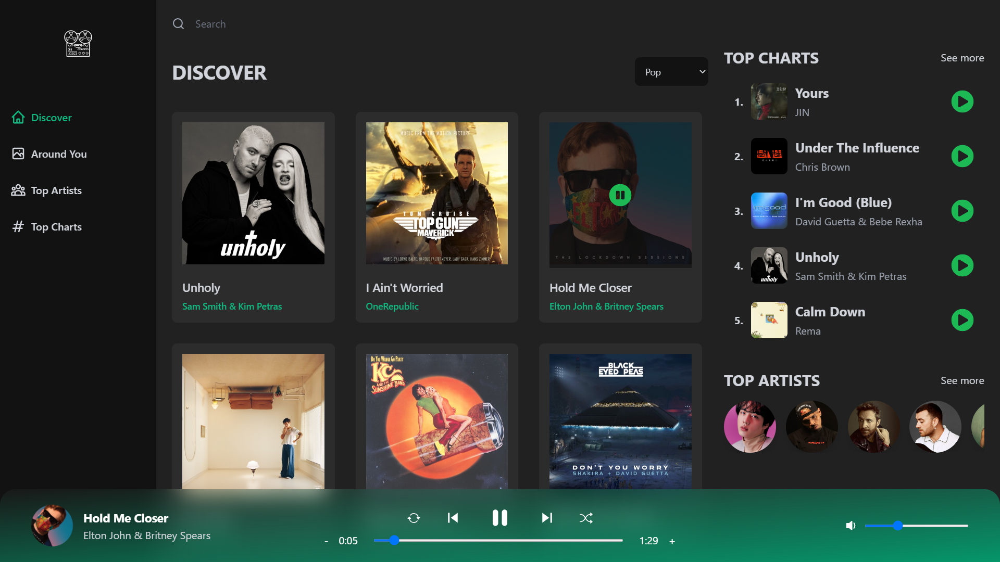
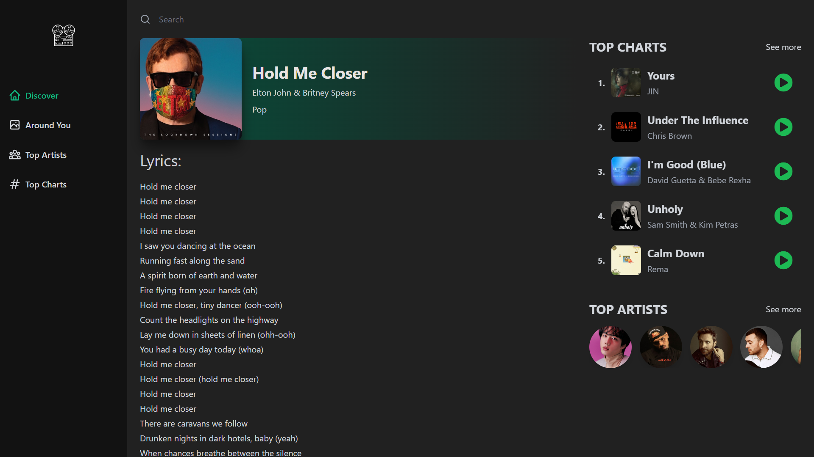
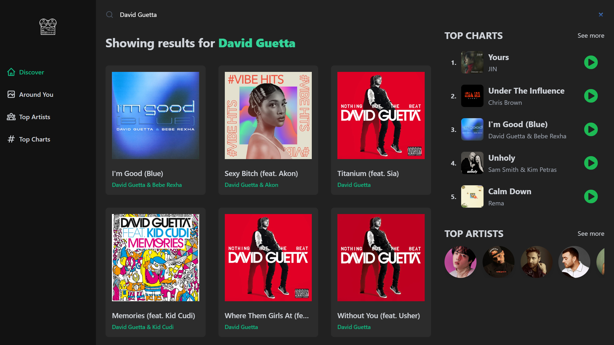

# Spotify-like clone music app

## Tools that was used

-   Front-end : [React](https://reactjs.org/), [React Redux](https://react-redux.js.org/)
-   CSS Framework: [Tailwind CSS](https://tailwindcss.com/)
-   APIs : [RapidAPI(Shazam Core API)](https://rapidapi.com/), [GEO API](https://geo.ipify.org/docs)
-   Buid Tool: [VITE](https://vitejs.dev/)

## Functionality

Listen songs around the world by searching what you love the most, pick any genres from the drop down menu,
explore top artists or top charts that popular in your country now. Check the lyrics of your favourite songs.
Click on the artist and check his songs and related content.

## If you want to try this project locally

1. Clone repo to your PC
2. Node and npm needed to run this project
3. Should have API keys of RapidAPI and GeoAPI
4. cd into main folder of the project

    ```bash
        $ npm install
    ```

5. into [.env.example] file input your API keys
6. Run

    ```bash
        $ npm run dev
    ```

7. Explore app on localhost:3000

## Screen Shots

Main view:

Lirycs of the songs:

Searching functionality:

